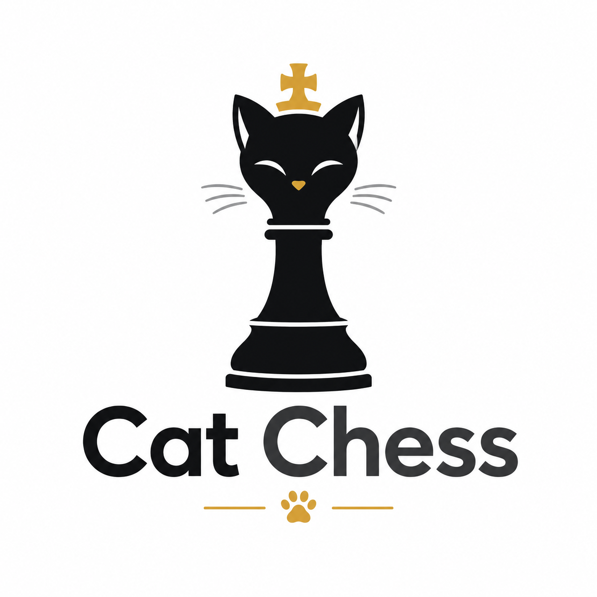

# Cat Chess

<p></p>

Minimal async chess without accounts.

Create a game, share a 6-symbol code, and play whenever you want.

```text
No accounts.
No timers.
No noise.
Just chess.
With cats.
```

## Apps

- `server` — backend for games, moves and player secrets
- `apps/web` — lightweight web client
- `apps/android` — placeholder for the native C Android client

## Shared

- `shared/protocol` — API and data format docs
- `shared/schemas` — JSON schemas for API payloads
- `shared/fixtures` — test game states and move examples

## Current status

Skeleton repository.

Android client is intentionally empty for now.
